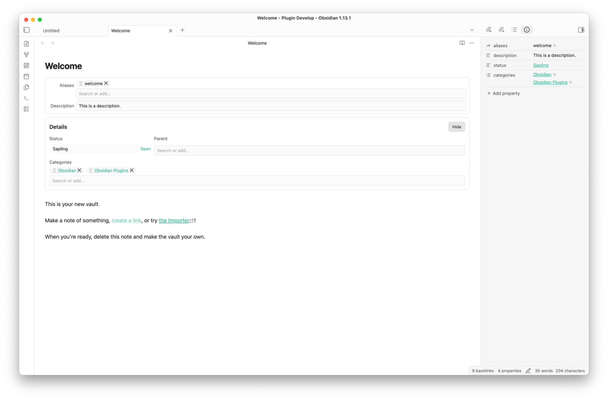

# Property Panels

Display and edit Obsidian frontmatter properties in configurable panels that stay inside the note's scrollable content.

Property Panels provides a visual settings editor for building compact metadata panels without writing JSON or CSS. Panels can be shared across the Vault or applied only to notes that match a folder, tag, or wikilink rule.

> [!WARNING]
> **AI development disclosure**
>
> Property Panels was created entirely by AI. Its architecture, source code, tests, build configuration, styles, and documentation were generated by AI rather than written by a human developer.
>
> The codebase has **not** received a complete line-by-line human review. Automated linting, builds, and tests can detect some problems, but they do not replace manual code review, security review, or testing inside Obsidian. Before using this plugin with an important Vault, test it in a separate Vault, keep a current backup, and consider having the source reviewed by a qualified developer. The plugin is provided without a guarantee that it is free of bugs, security issues, or data-loss risks.

## Preview



## Features

- Place multiple property panels before or after **Properties**, note content, or **Linked mentions**.
- Edit text, textarea, number, toggle, select, multi-select, date, datetime, progress, rating, and link values.
- Display readonly values and horizontal dividers alongside editable fields.
- Build options from static lists, another note's frontmatter, a Markdown list, or notes in a Vault folder.
- Apply different panels and layouts with folder, tag, or wikilink rules.
- Arrange fields in responsive grids with per-field column spans and four label positions.
- Use Obsidian icons in field labels and control whether the icon, label, both, or neither is shown.
- Search Select and Multi-select options with fuzzy matching; reorder, copy, edit, or remove Multi-select values.
- Open wikilinks, Markdown links, and HTTP(S) URLs directly from displayed values.
- Customize theme-aware colors, typography, spacing, borders, inputs, chips, ratings, and progress controls through Style Settings.
- Export, validate, and restore configuration through the advanced JSON editor.

Property Panels requires Obsidian 1.13.0 or newer and supports desktop and mobile.

## Installation

### Community plugins

Once Property Panels is available in the Community plugins directory:

1. Open **Settings → Community plugins**.
2. Select **Browse** and search for **Property Panels**.
3. Select **Install**, then **Enable**.
4. Open **Settings → Property Panels** to add your first panel.

### BRAT

Use [BRAT](https://github.com/TfTHacker/obsidian42-brat) to install the current GitHub version for testing before or outside the Community plugins release cycle:

1. Install and enable **BRAT** from **Settings → Community plugins**.
2. Open the command palette and run **BRAT: Add a beta plugin for testing**.
3. Enter `sakurastral/obsidian-property-panels` or the full repository URL: `https://github.com/sakurastral/obsidian-property-panels`.
4. Select **Add Plugin** and wait for BRAT to confirm the installation.
5. Open **Settings → Community plugins**, refresh the installed plugin list if needed, and enable **Property Panels**.

BRAT can also check for updates to the installed testing version. See the [BRAT quick guide](https://tfthacker.com/brat-quick-guide) for update and version-freezing options.

### Manual installation

1. Download `main.js`, `manifest.json`, and `styles.css` from the [latest release](https://github.com/sakurastral/obsidian-property-panels/releases/latest).
2. Create `<Vault>/.obsidian/plugins/property-panels/`.
3. Copy the three release files into that folder.
4. Reload Obsidian and enable **Property Panels** under **Settings → Community plugins**.

## Quick start

1. Open **Settings → Property Panels**.
2. Under **Default panels**, select **Add**.
3. Choose the panel name, insertion position, title visibility, and layout.
4. Under **Fields**, select **Add** and enter the frontmatter property name.
5. Choose a field type and adjust its label, icon, column span, empty-value behavior, and type-specific controls.
6. Add note rules if particular folders, tags, or wikilinks need a different panel configuration.

New installations start without a predefined panel, so enabling the plugin does not add fields to existing notes until you configure one.

## Configuration

### Panels and positions

Each panel can be enabled, named, styled with a custom CSS class, made collapsible, or displayed without a title. Supported insertion positions are:

- Before or after **Properties**
- Before or after the note content
- Before or after **Linked mentions**

Panels are part of the note's scrollable content. Plain Source Mode display is optional and disabled by default; Live Preview is unaffected by that setting.

### Field types

| Type | Purpose |
| --- | --- |
| Text / Textarea | Edit short or multi-line text with debounced saving. |
| Number / Toggle | Edit numeric and boolean frontmatter values. |
| Select / Multi-select | Choose values from a configured option source, with optional custom values. |
| Date / Datetime | Store local date or datetime strings without adding a timezone. |
| Progress / Rating | Edit numeric values with visual controls. |
| Readonly | Display a property without an input control. |
| Link | Display an HTTP(S), wikilink, or Markdown link; right-click to edit, copy, or clear its raw value. |
| Divider | Add a horizontal separator to a panel layout. |

Date fields store `YYYY-MM-DD`. Datetime fields use the local HTML datetime format, such as `2026-07-25T15:30`.

### Option sources

Select and Multi-select fields can load values from:

| Source | Description |
| --- | --- |
| Static | A list entered directly in the field settings. |
| File property | Values from a frontmatter property in another note. |
| Markdown list | List items below an optional heading in another note. |
| Folder | Notes in a selected folder, optionally including subfolders and excluding specific files. |

Folder sources can store each note as its full path or basename, optionally formatted as a wikilink. Labels can come from a property in the matching note.

### Note rules

Rules match notes by folder, tag, or wikilink. Each rule can:

- Extend the inherited panel configuration or replace it.
- Override panel definitions and layout values.
- Use priority to control the order of rules at the same depth.
- Be checked with the built-in rule tester before use.

### Layout and labels

Panel layouts support one to four columns, three density levels, configurable gaps, and these label positions:

- **Top**
- **Left**
- **Left, align end**
- **Inline**

Each field can span 1–12 columns. The span is clamped to the active panel width, and narrow screens fall back to a single-column layout. **Left, align end** uses a shared label column based on the longest visible label and aligns each label with the first control line.

### Multi-select and keyboard controls

- Focus an empty search field to list all available values; typing uses token-based fuzzy search.
- When custom values are enabled, **Add “…”** appears above the matching options.
- Drag the `grip-vertical` handle to reorder selected values.
- Select chip text normally, double-click a chip to edit it, or right-click for copy, edit, move, and remove actions.
- `Arrow Up` and `Arrow Down` change the active option, `Enter` selects it, and `Escape` closes the list.
- `Backspace` in an empty search field does not remove an existing chip.
- Rating controls support arrow keys, `Home`, `End`, `Delete`, and `Backspace`.

## Style Settings

Property Panels works without the [Style Settings](https://github.com/mgmeyers/obsidian-style-settings) community plugin. When Style Settings is installed, controls are grouped into Panel, Field, Select, Rating and Progress, and Multi-select sections.

Available controls include panel backgrounds and borders, title and label colors, field-input text and backgrounds, borderless inputs, Select colors, chip colors, Rating and Progress appearance, field value typography, icon styles, and drag-grip styles.

Color presets use official Obsidian CSS variables whenever possible, so the panels follow the active theme. Custom light and dark colors remain available when a theme variable is not suitable.

## Privacy and data handling

- Property Panels runs locally and does not make network requests.
- It does not include telemetry, analytics, advertising, or account requirements.
- Property edits are written with Obsidian's `FileManager.processFrontMatter()` API.
- **Delete empty values** is disabled by default. When enabled, clearing a field removes that frontmatter key.
- Diagnostics contain plugin state and counts only; note paths and property values are excluded.
- Plugin configuration is stored through Obsidian's standard plugin data API.

Keep a current backup of your Vault before testing any plugin that writes frontmatter.

## Known limitations

- Obsidian does not provide stable public insertion APIs for every supported panel position. Properties and Linked Mentions placement relies on isolated DOM selectors that may require maintenance after an Obsidian update.
- Placement, folder suggestions, note rules, mobile behavior, and theme compatibility should be smoke-tested in the Obsidian versions and themes you use.
- Obsidian's frontmatter processing may not preserve YAML comments exactly.
- Arbitrary Bases files, Markdown rendering, Meta Bind, Dataview, formulas, half-star ratings, and nested YAML editing are outside the plugin's scope.

If a panel cannot find its requested insertion point, Property Panels uses a nearby content fallback where possible. Enable **Debug logging** to inspect placement fallbacks in the developer console.

## Configuration backup and diagnostics

The **Advanced JSON editor** can copy the complete configuration, validate an edited configuration before saving, and restore defaults after confirmation.

Run **Property Panels: Copy diagnostics** from the command palette, or copy the same privacy-preserving report from the plugin settings.

## Development

```bash
npm install
npm run dev
```

Before submitting a change, run:

```bash
npm run lint
npm run build
npm test
```

`npm run build` performs TypeScript checking before bundling `main.js`.

## Releases

Release tags use the exact plugin version without a `v` prefix. Each GitHub release must include these individual assets:

- `main.js`
- `manifest.json`
- `styles.css`

See [CHANGELOG.md](CHANGELOG.md) for release history.

## Support and feedback

Report bugs or request features through [GitHub Issues](https://github.com/sakurastral/obsidian-property-panels/issues). When reporting a placement issue, include the Obsidian version, platform, theme, view mode, requested panel position, and the output of **Copy diagnostics**. Do not include private note content.

## License

Property Panels is released under the [MIT License](LICENSE).
